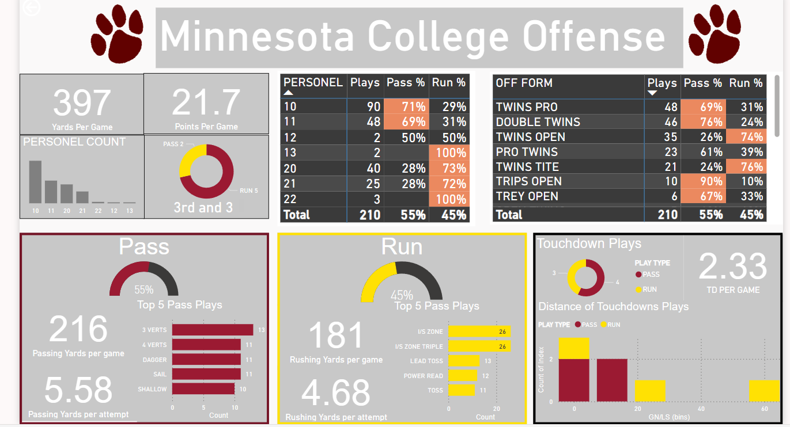
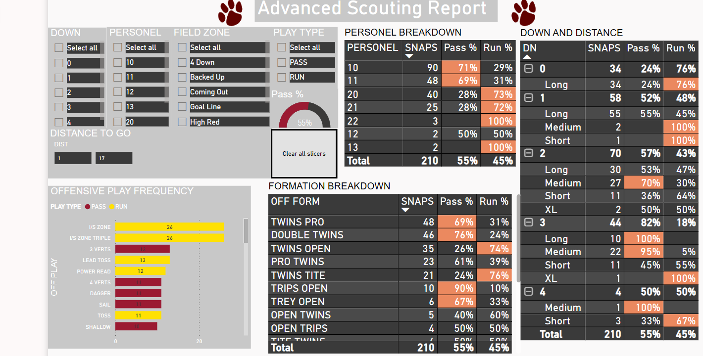

Here is a dashboard that produces analytics from data already available within Hudl. The template is made so you can simply change the source excel file and produce the same analytics for any team. These dashboard are interactive, and can easily be shared within an organization. 
Below are screenshots, please watch the video to see functionality of dashboards. 

[Video how to use the scouting report dashboard](https://drive.google.com/file/d/1ifP-tE6tu3bHdnf8XNO9f9eTBAjL6gCN/view?usp=sharing)

 [Video how to use the the advanced scouting report dashboard](https://drive.google.com/file/d/1ifP-tE6tu3bHdnf8XNO9f9eTBAjL6gCN/view?usp=sharing)
 
 
 
 
Here is the a[Acadmemic explenation for project](https://drive.google.com/file/d/1ifP-tE6tu3bHdnf8XNO9f9eTBAjL6gCN/view?usp=sharing) of the creation of the dashboard.